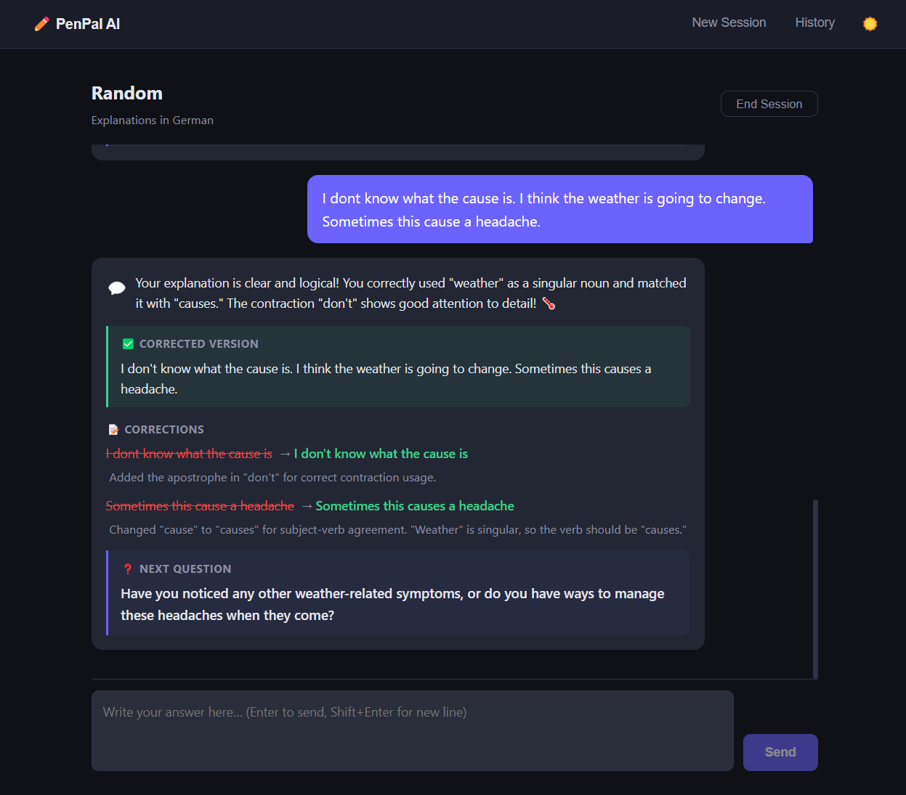
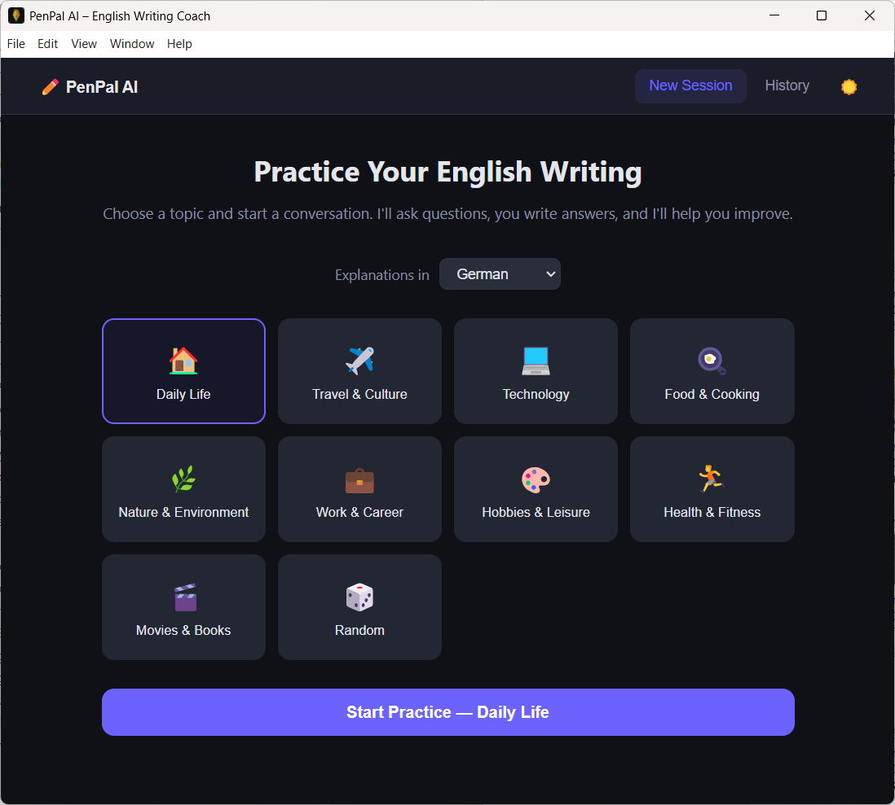
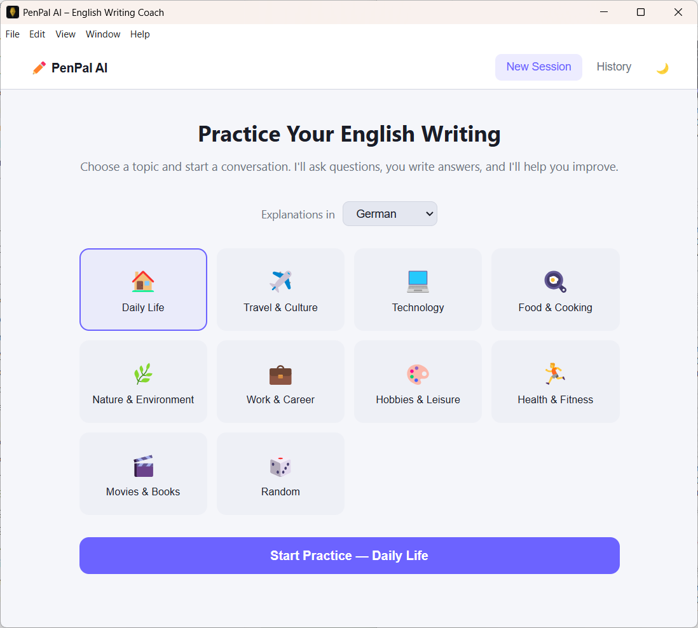

<p align="center">
  
</p>

# PenPal AI — English Writing Coach

[](LICENSE)

A desktop app that helps you improve your English writing through AI-powered conversations. The AI asks you questions, you write answers, and it returns corrections with explanations. Runs entirely on your machine via [Ollama](https://ollama.com) — no cloud, no account, no data leaves your computer.

> **Note:** This entire project — code, UI, and icon — was built with AI.

<p align="center">
  
</p>

<p align="center">
  
  &nbsp;
  
</p>

## Features

- **Guided writing practice** — AI asks topic-based questions for you to answer
- **Instant corrections** — every response shows what was wrong, the corrected version, and why
- **Selectable explanation language** — get correction explanations in English, German, Spanish, and more
- **Topic variety** — choose from 10 topic categories or let the AI pick randomly
- **Session history** — resume past conversations or review corrections
- **Streaming responses** — see the AI thinking in real-time

## Tech Stack

- **Frontend:** React + TypeScript + Vite
- **Desktop:** Electron
- **AI Engine:** [Ollama](https://ollama.com) (local, `ollama` npm package)
- **Persistence:** electron-store (local JSON)

## Prerequisites

- Node.js 18+
- [Ollama](https://ollama.com) installed and running (`ollama serve`)
- A compatible model pulled, e.g. `ollama pull qwen3` (default) or `ollama pull llama3.1:8b`

## Getting Started

```bash
# Install dependencies
npm install

# Run in development mode
npm run dev

# Build for production
npm run build

# Package as desktop app
npm run package
```

## Project Structure

```
electron/
  main.ts          # Electron main process, IPC handlers, persistence
  preload.ts       # Secure IPC bridge to renderer
  ollama.ts        # Ollama session management and response parsing
  prompts.ts       # System prompt builder for the writing tutor
src/
  main.tsx         # React entry point
  App.tsx          # App shell with screen routing
  components/
    HomeScreen.tsx     # Topic selection and settings
    PracticeScreen.tsx # Writing conversation UI
    CorrectionCard.tsx # Correction display component
    HistoryScreen.tsx  # Session history browser
  shared/
    types.ts       # Shared TypeScript types (IPC contracts)
  index.css        # Global styles (dark theme)
  global.d.ts      # Ambient type declarations
```

## How It Works

1. The app starts an Ollama chat session with a system prompt that makes the AI act as a writing tutor
2. The AI asks a question about the chosen topic
3. You write your answer in the text box
4. The AI returns a structured response with:
   - Your corrected text
   - Each correction with an explanation (in your chosen language)
   - Encouragement about what you did well
   - A follow-up question to continue the conversation

## Contributing

Found a bug or have a feature idea? [Open an issue](../../issues) — contributions and feedback are welcome!

## License

[MIT](LICENSE)
